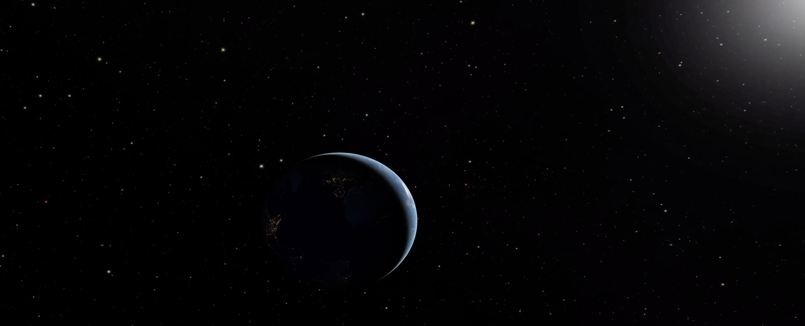

This is a page for Deion Desir - Educator, Scientist, Visualizer, and New Yorker

# Resume
- [Education](#education)
- [Work Experience](#work-experience)
- [Skills](#skills)
- [Portfolio](#portfolio)

---

## Education

- **Bowdoin College**
  - *Bachelor's in the Arts, Earth and Oceanographic Sciences*
  - 2016

- **Richard Gilder Graduate School**
  - *Master of Arts in Teaching, Specialized in Earth Science grades 7-12*
  - 2017

---

## Work Experience

- **High School Educator**
  - *Eagle Academy for Young Men II, Brooklyn*
  - September 2017 - September 2023
  - Planned and Taught 5 Computer Science and Earth Science classes

- **Visiting Scientist**
  - *American Museum of Natural History*
  - September 2019 - Present
  - Pilot the software "Openspace" in the Hayden Planetarium for presentations and events
  - Creating a digital library of Astronomy programming
  - Assists astronomers in visualizing contemporary space data using Python, Glue, and Openspace

---

## Skills

- Adobe Suite (Premiere, Photoshop, Illustrator)
- Python, Lua, JavaScript, Anaconda, Github
- Microsoft Office Suite (Excel, Word, PowerPoint)
- Ableton Live, Logic

## Portfolio 

Here are some examples of my work currently available on the web:

- [Next 20 Years of Solar Eclipses!](https://youtu.be/MySb6YbM-cY?si=D4dxCCJ4_i5FD1Qw)

- [Astronomer's Guide to 2024 Total Solar Eclipse](https://www.youtube.com/watch?v=_9GA0PjOSbI)

- [Known Universe in 360 Degrees](https://www.youtube.com/watch?v=N79TowJOHHE)
 

- [Astronomy Live](https://www.youtube.com/watch?v=4b61xxeAa4U)
  

- [Press Release: TESS Exoplanets](https://www.youtube.com/watch?v=GL0SJTFWejA)
  

- [Press Release: 14 Her](https://www.youtube.com/watch?v=6m0Rfs2hnkA)
  
